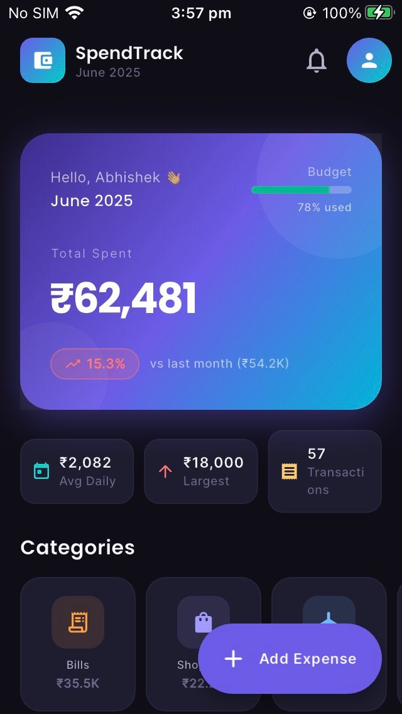
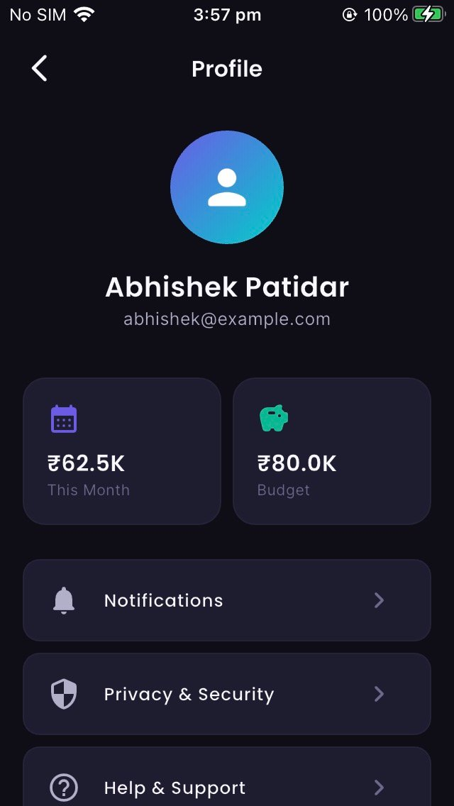
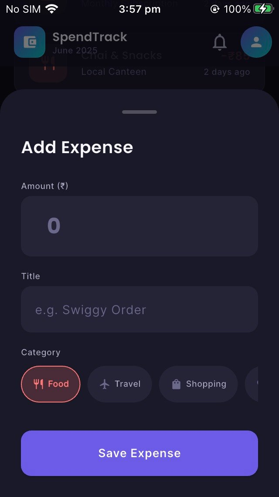
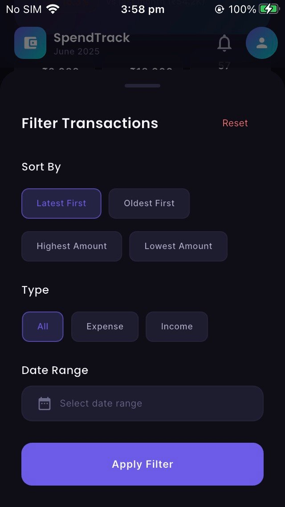
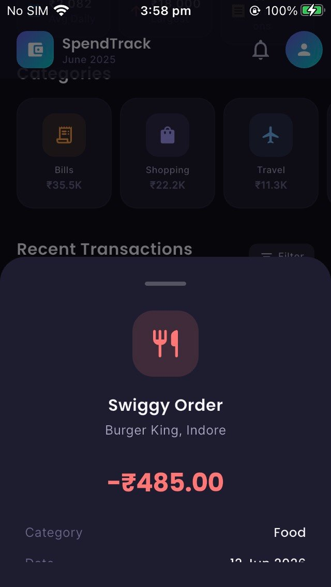

# SpendTrack – Spend Summary App

A beautiful Flutter app for tracking monthly expenses with a clean dark-mode UI.

---

## 📱 Features

- **Header Card** – Monthly spend with % change vs last month + budget progress
- **Quick Stats Row** – Average daily spend, largest transaction, total count
- **Category Scroll** – 8 categories (Food, Travel, Shopping, Health, Entertainment, Bills, Education, Others) with icons, amounts, and tap-to-filter
- **57 Transactions** – Complete mock dataset with tap to view details
- **Add Expense FAB** – Bottom sheet with amount, title, and category picker
- **Profile Screen** – User info, stats, and settings
- **Smooth Animations** – Shimmer loading, slide-in entries, fade effects

---

## 📸 Screenshots

> Tested on Android Emulator — June 2025

| Home Screen | Profile Screen |
|:-----------:|:--------------:|
|  |  |

| Add Expense | Filter Transactions |
|:-----------:|:-------------------:|
|  |  |

| Transaction Detail |
|:------------------:|
|  |

---

## 🗂 Project Structure

```
lib/
├── main.dart
├── core/
│   ├── constants/        # Colors, text styles, sizes
│   ├── theme/            # AppTheme
│   ├── utils/            # CurrencyFormatter, DateFormatter
│   └── services/         # MockDataService (57 transactions)
├── models/
│   ├── transaction_model.dart
│   ├── category_spend_model.dart
│   └── user_model.dart
├── providers/
│   ├── auth_provider.dart
│   ├── user_provider.dart
│   └── spend_provider.dart
├── screens/
│   ├── auth/login_screen.dart
│   ├── home/home_screen.dart
│   └── profile/profile_screen.dart
├── widgets/
│   ├── spend_header_card.dart
│   ├── category_scroll_section.dart
│   ├── transaction_tile.dart
│   ├── transaction_list_section.dart
│   ├── add_expense_sheet.dart
│   ├── loading_widget.dart
│   ├── custom_button.dart
│   └── custom_textfield.dart
├── repositories/
│   ├── auth_repository.dart
│   └── product_repository.dart
└── routes/
    └── app_routes.dart
```

---

## 🚀 Getting Started

```bash
# Install dependencies
flutter pub get

# Run on emulator or device
flutter run
```

**Minimum SDK:** Flutter 3.x, Dart 3.x  
**Target:** Android / iOS

---

## 📦 Dependencies

| Package | Use |
|---|---|
| `provider` | State management |
| `google_fonts` | Poppins + Inter typography |
| `flutter_animate` | Smooth entry animations |
| `shimmer` | Loading skeleton |
| `fl_chart` | Available for future chart widget |
| `intl` | Currency & date formatting |

---

*Built with ❤️ using Flutter*
